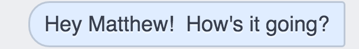

#Facebook: What's Up?



Do you ever feel like you have friends on Facebook who you haven't talked to in forever?  Do you wish you could re-connect, but you're not sure how to start the conversation?

Why not have an application send an initial "What's Up?" message to break the ice without interrupting your day?  That way you can dive right back into re-connecting with your facebook friend once they reply?

By default the application will send three "What's up" messages per day - once in the morning, once in the afternoon and once in the evening.  Within a single session the messages are non-repeating, so if you leave it running continuosly for a few months there shouldn't be any repeat re-connections with friends.  This behaviour can be altered in the scheduleRecurringMessages() function.

##Installing dependencies
This app runs on node.js.  If you have node installed, simply run npm install inside the directory to download the dependencies.  This app is built on top of these great projects:<br>

<a href="https://github.com/Schmavery/facebook-chat-api">facebook-chat-api</a> by Avery Morin<br>
<a href="https://github.com/node-schedule/node-schedule">node-schedule</a>


##Running the application

This application uses fb-client-api to send messages, which uses your facebook email and password to simulate a web browser login.  Set these values in constants.js so that the application can access your facebook page.

<b>NB: I do not control the source code for fb-client-api.  It is possible that future releases might log/store your password.  Be sure to check through the source code when you install dependencies if you want to be extra safe.</b>

Run the application with:

```
node reconnect.js
```

In order to run the application on a server I recommend using <a href="https://www.npmjs.com/package/forever">forever</a>.  Once it's installed start the application with:

```
forever start reconnect.js
```

<b>NB: If your server is not located locally facebook may block the app for security reasons.  When you log into facebook simply verify that you are the one issuing the login requests and the app will be able to function normally.</b>

##License
This software is released under GNU GLP3.0.  
Copyright Kevin M. Karol, 2016.